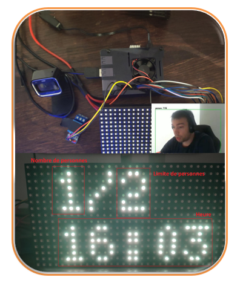

# NP Project
Number of person repository, where all the work is set up.

The NP is a **Polytech Tours** project aiming at showing all the skills studied in the industrial computer science classes.



## For one user, one manual

The **doc** folder is full of documentation resources that you'll use to rebuild this project. If you are an **Administrator, Developer, Maintener, Demonstrator or a Simple User** of the system you'll be able to find exactly what your role is in this project and what you can do with it.

*Check out the [doc folder](doc/) for more information !*

## Requiements
    - Raspberry Pi 4 4go or more
    - sdcard 8go or more
    - LED Matrice 32x16
    - Power supply : 3A/5V (Board) + 2A/5V (LED Matrice)
    - USB Webcam
    - 5v relay

## Gathering all the programs

We will create a folder with the given structure:

```
Projet_NP/
├── README.md
├── doc
│   ├── Administrator
│   │   └── README.md
│   ├── Developer
│   │   ├── INSTALL.md
│   │   └── README.md
│   ├── Maintener
│   │   ├── Diagnostic_Matrice_LED.jpg
│   │   ├── Diagnostic_Person_D.jpg
│   │   └── README.md
│   ├── RaspberryDebian
│   │   └── README.md
│   ├── Spec_and_Design
│   │   ├── images
│   │   ├── CA_NP_MARTINEZ_Pablo.pdf
│   │   ├── CDC_NP_MARTINEZ_Pablo.pdf
│   │   ├── Rapport_NP_MARTINEZ_Pablo.pdf
│   │   └── Wiring_NP.pdf         
│   ├── User
│   │   └── User_Manual.pdf
│   └── NodeRED
│       ├── flows
│       └── README.md
├── install_services.sh
├── parametre_projet.json
├── run.sh
├── TFLite_detection_webcam.py
├── Projet_NP-env
├── rpi-rgb-led-matrix
│   ├── libs (c) Henner Zeller <h.zeller@acm.org>
│       └── bindings
│           └── python
│               └── samples
│                   ├── clean_matrice.py
│                   └── matrice_led.py
└── Sample_TFLite_model
    ├── detect.tflite
    └── labelmap.txt
```

>Use this procedure to start : [Linux Install on Raspberry PI 4](doc/RaspberryDebian/README.md)

>Link to the git repository : [**Project_NP**](https://github.com/Layapanda/Projet_NP)
- Use git clone command on the **/home/pi/** folder.
```
git clone https://github.com/Layapanda/Projet_NP.git
```
- or download and copy it to **/home/pi/** on your Raspberry PI 4 board.

> That should look like **/home/pi/Projet_NP**

>Then follow this procedure : [Wiring project](doc/Specs_and_Design/Wiring_NP.pdf)

>Then just run the [install_services.sh](install_services.sh) file in the **Projet_NP** folder.

Once this is done you will finally import the NodeRED flows using this procedure : [NodeRED flows install](src/wbtc_manager/NodeRED/README.md)
