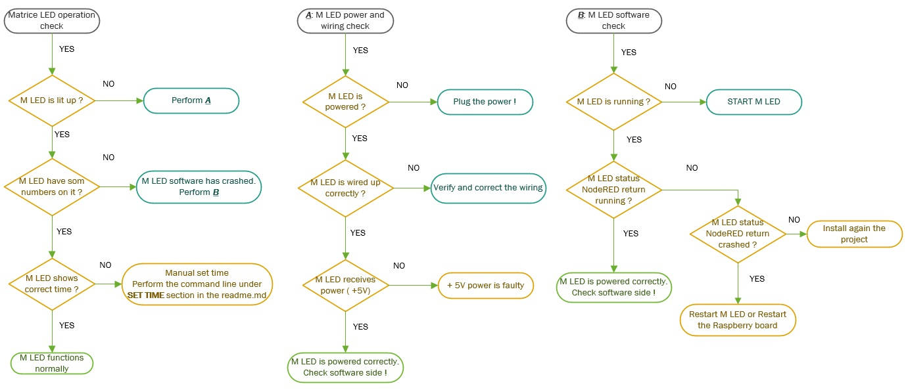

# NP Maintener

You are a maintener of the system, you are going to perform several tests of the system to make sure it is working properly.

The goals are the following:

1. Check the wiring of the system
2. The system boots the debian 10 image
3. Make sure daemons for the Matrice LED, Object detection and Relay are registered and started
4. Make sure NodeRED is deployed and running

We will analyse different failure cases for you to analyse.

# Normal operating mode

In a normal operating mode the following are valid:

1. NodeRED is available at **http://[YourBoardIP]:1880** and your dashboarbd is available at **http://[YourBoardIP]:1880/ui**
2. The LED Matrice is glowing with the time and severals numbers

# Possible Failures

## The Matrice LED doesn't work properly

Please follow the following diagram to perform a system diagnostic for the **Matrice LED** module.



# SET TIME

```
sudo rm /etc/localtime
sudo ln -s /usr/share/zoneinfo/Europe/Paris /etc/localtime
```

## The person detection doesn't work properly

Please follow the following diagram to perform a system diagnostic for the **Person detection** module.


